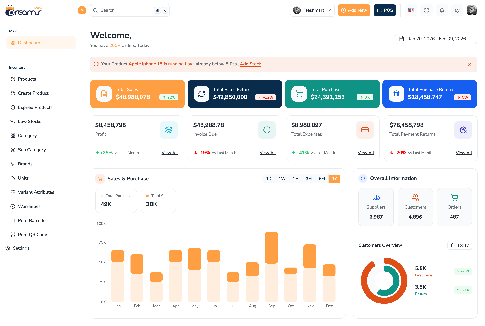
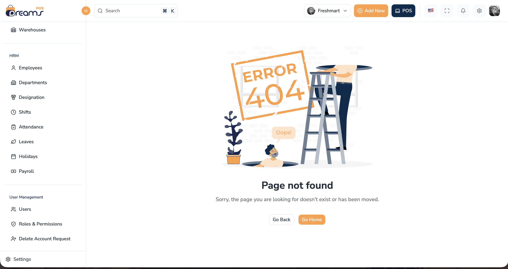

# POS & Inventory Management

A full-featured Point-of-Sale and Inventory Management dashboard built with a modern React stack. Designed and implemented following a professional [Figma design](https://www.figma.com/design/CdNn7rMoMUBqTLNlsh9SF4/DreamsPOS-%E2%80%93-POS---Inventory-Management-Admin-Dashboard--React--Vue--Angular--Laravel---Community-?node-id=0-1&t=3JxPT3rgBOwuFKpy-1) — click the link to see the reference UI this project is built against.

---

## Screenshot of Screens Created till now

| Dashboard | 404 Page |
|---|---|
|  |  |

---

## Tech Stack

| Layer | Technology |
|---|---|
| Framework | React 19 |
| Language | TypeScript 5 |
| Routing | React Router v7 |
| Styling | Tailwind CSS v4 + shadcn/ui |
| State Management | Zustand |
| Server State | TanStack Query v5 |
| Forms | React Hook Form + Zod |
| Charts | Recharts |
| Data Tables | TanStack Table v8 |
| Build Tool | Vite 8 |
| Linter / Formatter | Biome |

---

## Features (till now)

- Collapsible sidebar with icon mode and mobile sheet drawer
- Responsive dashboard header with adaptive action visibility
- Financial summary cards with trend indicators
- Stacked bar chart for Sales vs Purchase with timeline selector
- Radial bar chart for Customer overview (First Time vs Return)
- 404 and Error boundary pages with SVG illustrations
- Dark mode support via CSS custom properties
- Feature-based folder architecture (see [Folder Structure](#folder-structure))

---

## Getting Started

```bash
# Install dependencies
pnpm install

# Start development server
pnpm dev

# Type-check and build for production
pnpm build

# Lint
pnpm lint

# Format
pnpm format
```

---

## Project Structure

The project follows a **feature-based architecture** — all code related to a feature lives in one place instead of being spread across top-level folders. See the full breakdown in [`docs/folder-structure.md`](./docs/folder-structure.md).

**Key architecture rules enforced:**

- `components/` never imports from `features/`
- Features never import from each other
- Route paths are typed constants — no hardcoded strings in components
- Feature-local state stays inside the feature; only truly global state goes in `store/`

---

## Design Reference

This project implements the **DreamsPOS** Figma community file:

> [DreamsPOS — POS & Inventory Management Admin Dashboard](https://www.figma.com/design/CdNn7rMoMUBqTLNlsh9SF4/DreamsPOS-%E2%80%93-POS---Inventory-Management-Admin-Dashboard--React--Vue--Angular--Laravel---Community-?node-id=0-1&t=3JxPT3rgBOwuFKpy-1)

The design covers the full dashboard shell, inventory pages, sales flows, finance & accounts, HRM, and user management screens.

---

## Scripts

| Command | Description |
|---|---|
| `pnpm dev` | Start local dev server |
| `pnpm build` | Type-check + production build |
| `pnpm preview` | Preview production build locally |
| `pnpm lint` | Run Biome linter |
| `pnpm format` | Auto-format with Biome |
| `pnpm check` | Lint + format in one pass |
| `pnpm generate:feature` | Scaffold a new feature module |
